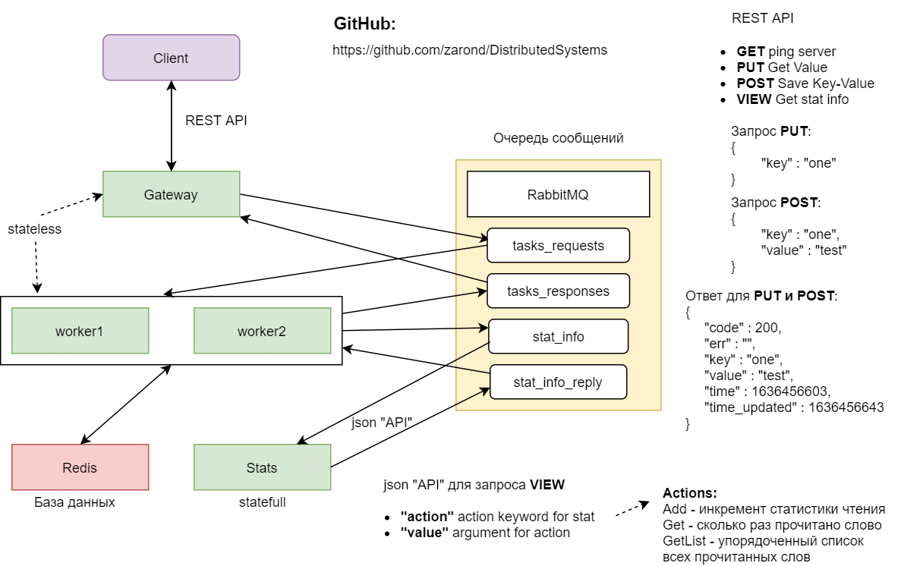
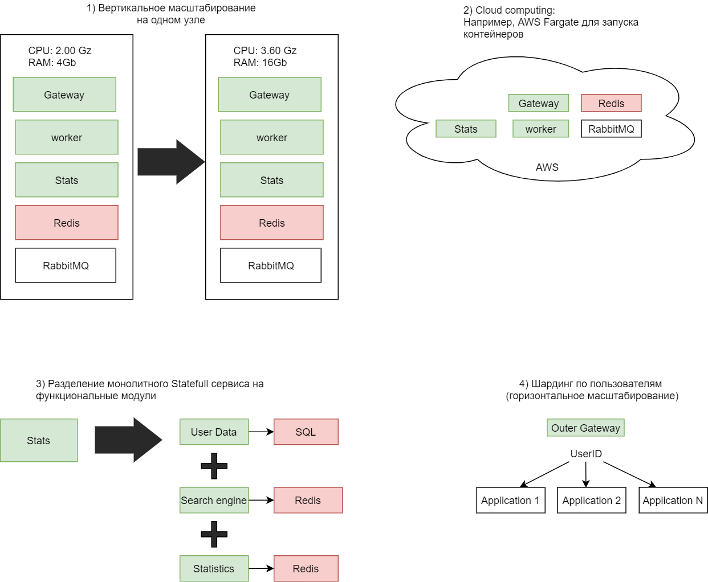

# Толковый словарь

Программа-толковый словарь позволяет пользователям читать и создавать собственные толкования слов. Кроме текстовой информации в базе данных хранятся метаданные, такие как время последнего изменения толкования каждого слова. Эти метаданные создаются сервисом worker. Данные хранятся в БД Redis типа ключ-значение. Сервисы реализуют схему RPC вызовов с помощью менеджера очередей сообщений RabbitMQ, используя пары очередей. Сервисы Gateway и Worker - не хранят состояния, сервис Gateway не проверяет содержания сообщения, а только реализует схему REST API, соединяя http реквесты и ответы сервиса worker, с которым обменивается информацией через очереди. Сервис Stats используется для statefull информации о статистике взаимодействия пользователей со словарем. Запросы для сервиса Stats могут посылаться пользователями, а также и сервисом worker, который может, например, посылать запрос на инкремент счетчика доступа к слову. Сервис Stat поддерживает в реальном времени информацию о количестве запросов к разным словам, составляет и выдает упорядоченный список слов по популярности, а также может выдавать "Слово дня". Также, сервис Stat может потенциально выполнять и другие statefull функции, такие как умный поиск с авто заполнением, собирать данные о словах, которые ищут пользователи, но которых нет в БД, хранить информацию о профилях пользователей.

## масштабирование

Относительно вопроса масштабирования stateful сервиса: на первых этапах хватит вертикального масштабирования (то есть увеличение мощности одного нода). Проблема такого подхода в ограниченных пределах масштабирования. Существуют предел мощности CPU и пропускной способности памяти в одном ноде. В этом случае также невозможно динамическое масштабирование в зависимости от текущей нагрузки, в результате чего можно остаться с дорогим железом, которое будет редко использоваться на 100% от возможностей. 
Второй этап – использование Cloud Computing платформ, таких как Amazon AWS, Microsoft Azure. Данный подход требует внедрения логики интеграции с сервисами выбранной платформы, но открывает большие возможности по динамическому масштабированию, безопасности, а также дает использовать набор стандартных программных компонентов от платформы, например сервис для аутентификации и хранения паролей, базы данных, лямбда функции. Если приложение разделено на контейнеры, то можно использовать сервис AWS Fargate, предназначенный для запуска Docker образов и выделения строго необходимых мощностей для каждого микросервиса.
Третий подход к масштабированию: разделение единого stateful сервиса на несколько малых, выполняющих только одну функцию. Например, отдельные микросервисы для умного поиска, сервис для сбора статистики и рейтинга слов в реальном времени, отдельный сервис для данных профиля пользователей с выделенной БД. Монолитный stateful сервис удобнее в проектировании, но при увеличении нагрузки может оказаться, что одна из функций сервиса является более затратной чем другие и является бутылочным горлышком для всей системы. Полученная выгода от разделения может превысить затраты на усложнение системы, но возможность разделения зависит от того, насколько сложно поддерживать общее состояние. Например, система поиска может зависеть от данных конкретного пользователя и от данных статистики по всем пользователям, но результаты не пострадают, если состояние будет обновляться гораздо реже, чем в каждый пользовательский запрос. 
Четвертый шаг - шардинг (горизонтальное деление), то есть разделение нагрузки путем логического распределения данных и операций с ними. Для сервиса, работающего с профилями пользователей, хранящимися в реляционной БД (напр. Postgresql) будет полезно использовать шардинг данных, а также, в случае необходимости отслеживать сессию пользователя, нод может работать только с частью пользователей, в зависимости от арифметического модуля от id пользователя. Realtime данные о статистике запросов к словам можно разделить по диапазонам первой буквы слова. Для отслеживания истории изменения и других данных с временными отметками можно использовать TimescaleDB - особую реляционная БД, основанную на Postgresql, и оптимизированную для работы с данными с отметкой времени. Избыточность по данным может быть полезна, потому что хранение дополнительных данных дешевле, чем оптимизация приложения.
